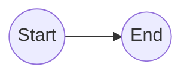
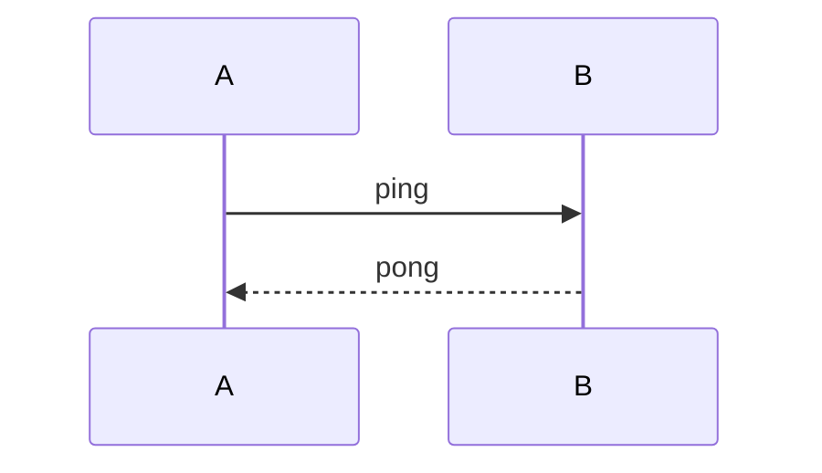

# Level 2 Demo

```mermaid
flowchart LR
  S((Start)) --> E((End))
```

<!-- mmd-rendered:l2-mermaid-1-250f3110b3.png -->

```mermaid
sequenceDiagram
  participant A
  participant B
  A->>B: ping
  B-->>A: pong
```

<!-- mmd-rendered:l2-mermaid-2-b8097e0abd.png -->
