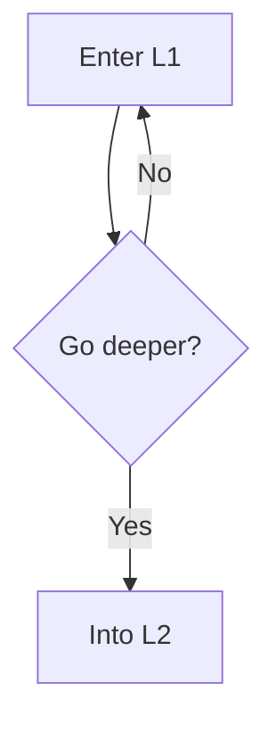
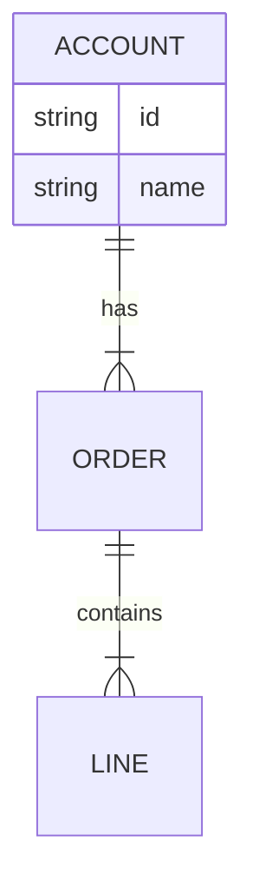

# Level 1 Demo

```mermaid
flowchart TD
  X[Enter L1] --> Y{Go deeper?}
  Y -- Yes --> Z[Into L2]
  Y -- No  --> X
```

<!-- mmd-rendered:l1-mermaid-1-6a7302a38c.png -->

```mermaid
erDiagram
  ACCOUNT ||--|{ ORDER : has
  ORDER ||--|{ LINE : contains
  ACCOUNT {
    string id
    string name
  }
```

<!-- mmd-rendered:l1-mermaid-2-989f7ecb3a.png -->
