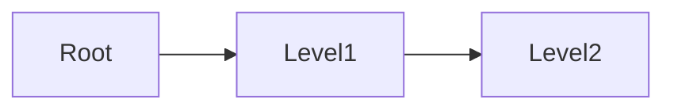
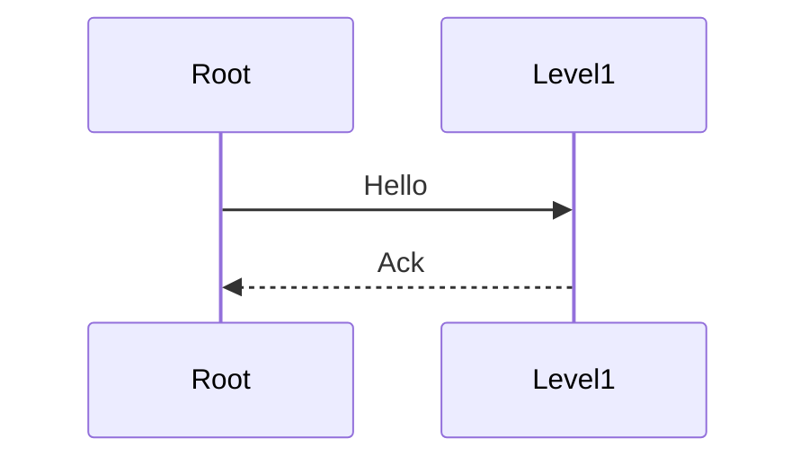

# Root Demo

```mermaid
flowchart LR
  A[Root] --> B[Level1]
  B --> C[Level2]
```

<!-- mmd-rendered:root-mermaid-1-e89ce6f26a.png -->

```mermaid
sequenceDiagram
  participant R as Root
  participant L1 as Level1
  R->>L1: Hello
  L1-->>R: Ack
```

<!-- mmd-rendered:root-mermaid-2-c7e9103a4c.png -->
