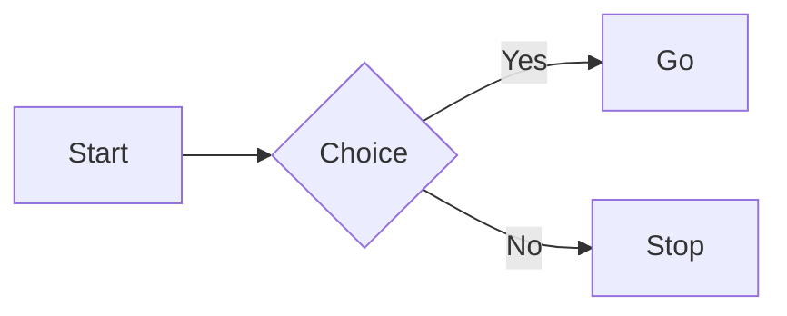
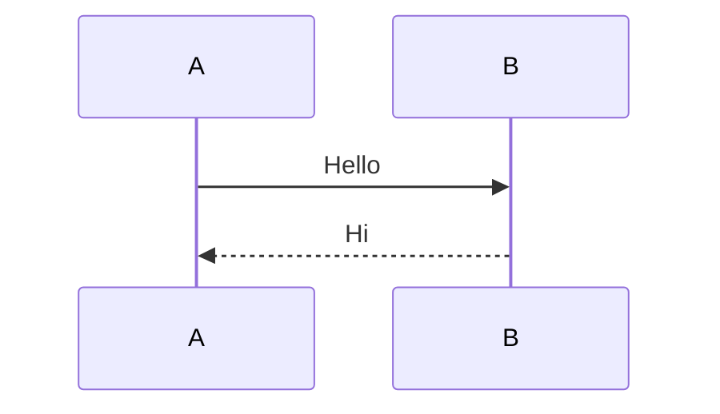
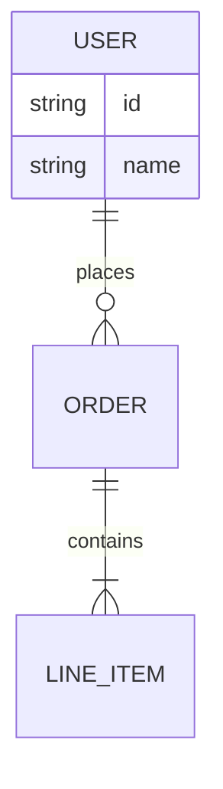

# Test Diagrams

<!-- mmd-rendered:test_diagrams-mermaid-1-75d5d9cfd2.png -->

<!-- mmd-rendered:test_diagrams-mermaid-2-cd27d6eced.png -->

<!-- mmd-rendered:test_diagrams-mermaid-3-db5f0ed1ad.png -->
